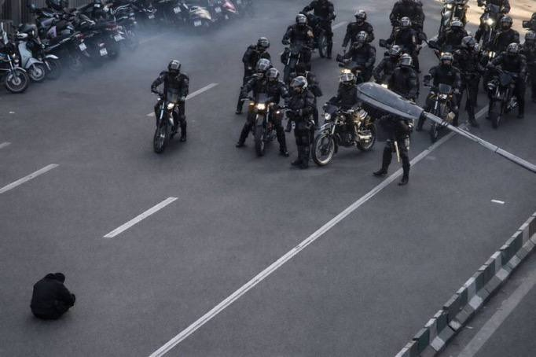

<div align="center">



# 🕊️ زن، زندگی، آزادی ✌️

### برای مردم شجاع ایران که هرگز تسلیم نشدند

---

> *«تا وقتی که صدای ما شنیده نشود، هیچ دیواری ما را متوقف نخواهد کرد»*

---

</div>

## 📥 لینک اشتراک رایگان

برای دسترسی آزاد به اینترنت، این لینک را کپی کنید:

```
https://anonymous87ew-blip.github.io/zan-zendegi-azadi/sub_base64.txt
```

<div align="center">

**این سرویس کاملاً رایگان است و توسط ایرانیان خارج از کشور ارائه می‌شود**

*ما با شماییم* 🤍

</div>

---

## 📱 راهنمای نصب

<details>
<summary><b>اندروید (v2rayNG)</b></summary>

<br>

1. برنامه **v2rayNG** را از [گوگل پلی](https://play.google.com/store/apps/details?id=com.v2ray.ang) یا [GitHub](https://github.com/2dust/v2rayNG/releases) دانلود کنید

2. برنامه را باز کنید و از منو ☰ گزینه **Subscription group setting** را انتخاب کنید

3. روی دکمه **+** بزنید

4. لینک بالا را در قسمت **URL** بچسبانید

5. تأیید کنید و از منوی اصلی **Update subscription** را بزنید

6. یکی از سرورها را انتخاب کنید و **Connect** بزنید

**تمام!** حالا آزادانه از اینترنت استفاده کنید.

</details>

<details>
<summary><b>آیفون (V2Box / Streisand)</b></summary>

<br>

1. یکی از برنامه‌های زیر را نصب کنید:
   - [V2Box](https://apps.apple.com/app/v2box-v2ray-client/id6446814690)
   - [Streisand](https://apps.apple.com/app/streisand/id6450534064)

2. روی **+** یا **Import** بزنید

3. گزینه **Import from URL** یا **Add Subscription** را انتخاب کنید

4. لینک بالا را بچسبانید

5. سرور مورد نظر را انتخاب و وصل شوید

</details>

<details>
<summary><b>ویندوز / مک (v2rayN / Qv2ray)</b></summary>

<br>

1. برنامه [v2rayN](https://github.com/2dust/v2rayN/releases) را دانلود کنید

2. از منو **Subscription setting** را باز کنید

3. **Add** بزنید و لینک بالا را وارد کنید

4. **Update subscription** را بزنید

5. سرور انتخاب کنید و وصل شوید

</details>

---

## ❓ نکات مهم

- **رایگان و بدون ثبت‌نام** - نیازی به ایمیل یا شماره تلفن نیست
- **آپدیت خودکار** - لیست سرورها مرتباً به‌روز می‌شود
- **اگر وصل نشد** - ابتدا subscription را آپدیت کنید، سپس سرور دیگری امتحان کنید
- **به اشتراک بگذارید** - این لینک را به دوستان و خانواده‌تان بدهید

---

<div align="center">

### ما ایستاده‌ایم کنار شما

*هر دیواری که بسازند، راهی برای عبور پیدا می‌کنیم*

---

**زن** ⟡ **زندگی** ⟡ **آزادی**

🤍

---

<sub>این پروژه متعلق به مردم ایران است</sub>

</div>
